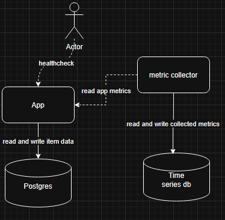

# senior-be-developer-task
# configure and run
* > npm install

* > cp .env.example .env

* > docker compose up item_data_storage

* > npx prisma migrate deploy

run in docker
* > docker compose build
* > docker compose up

run on local 
* > npm start

## diagram 

pros:
- Allows parallel processing per key	
- Memory efficient in-memory implementation	
- Easy to reason about and test	

cons:
- Guarantees strict ordering per key	
- If a worker never calls confirm(), the key is stuck
- waitQueues can grow large without cleanup
- No native retry/backoff — must be implemented manually
